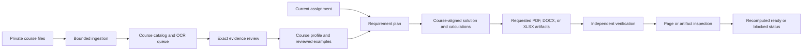

# Architecture

Calvin Autonomy separates a shareable execution framework from private course content. The repository contains skills, agents, schemas, deterministic helpers, and validation rules. Each student's `workspace/` contains source copies, extracted evidence, durable reviews, course profiles, assignment runs, memory, evaluation records, and deliverables. The private workspace is ignored by Git and excluded from distribution audits.

## Public framework

| Area | Purpose |
| --- | --- |
| `skills/` | Claude Code and Codex workflows for setup, ingestion, course profiles, completion, memory, and verification |
| `.claude/agents/` and `.codex/agents/` | Coordinator, verifier, and course-profile curator adapters |
| `src/engineering_assistant/` | Ingestion, evidence, matching, adaptation, rendering, calculations, runtime integrity, evaluation, and setup diagnostics |
| `templates/` | Content-free private-run schemas |
| `scripts/setup.py` | Idempotent project-scoped installation of skills, agents, templates, and launcher |
| `scripts/check_distribution.py` | Public-tree privacy and secret-name audit |

## Private workspace

Each course catalog stores preserved source copies, SHA-256 hashes, extraction status, exact locators, and text hashes. Native extraction and imported OCR remain unreviewed until an exact location is checked and recorded in the durable review registry. Course profiles may use only reviewed same-course evidence.

Each assignment run binds the current input, plan, course profile, solution, calculation checks, requested artifacts, independent verification report, and visual inspection records. A downstream record becomes stale when an upstream hash changes. `status` recomputes readiness from the current files and does not trust a previously saved stage.

## Assignment interaction

A student opens the project in Claude Code or Codex and asks the `assignment-coordinator` to complete an uploaded assignment. The coordinator uses `complete-assignment`, creates the private structured assignment and plan, retrieves reviewed same-course evidence and examples, classifies any prior variant, recalculates current values, and renders the declared deliverables. The `assignment-verifier` independently checks every requirement, method, numerical result, format, identity field, and rendered artifact. The student receives final files only when the recomputed status is ready; missing inputs remain an explicit blocked run.

The `course-profile-curator` is used once when a course is added and again when controlling instructions change. It converts reviewed instructor materials and anonymized examples into course-scoped method and formatting rules without publishing the source documents or student identity.

## Extension boundary

New course support is added in the private workspace through evidence, reviewed examples, assignment-family records, and course profiles. New public code is needed only for a new file type, deterministic calculation or rendering capability, or integrity rule. Course documents and completed student work do not belong in the public repository.
